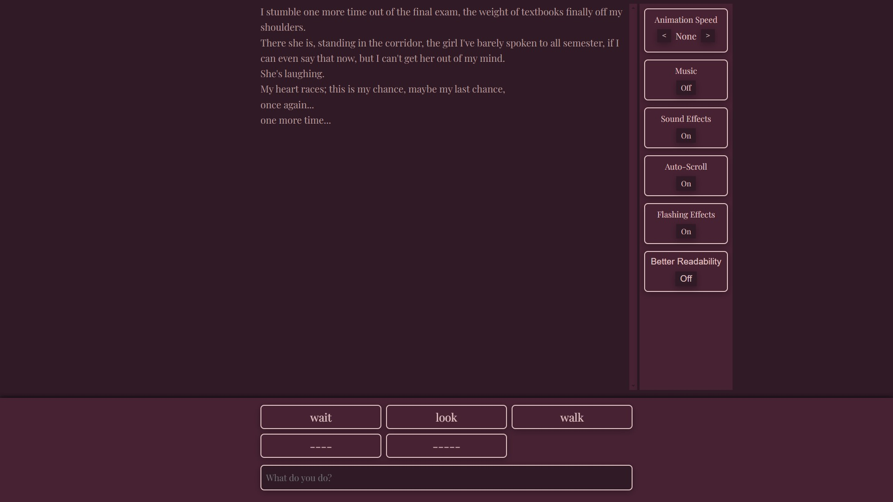
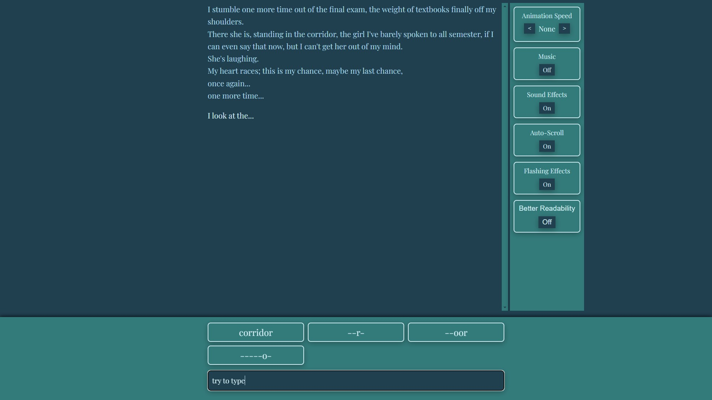
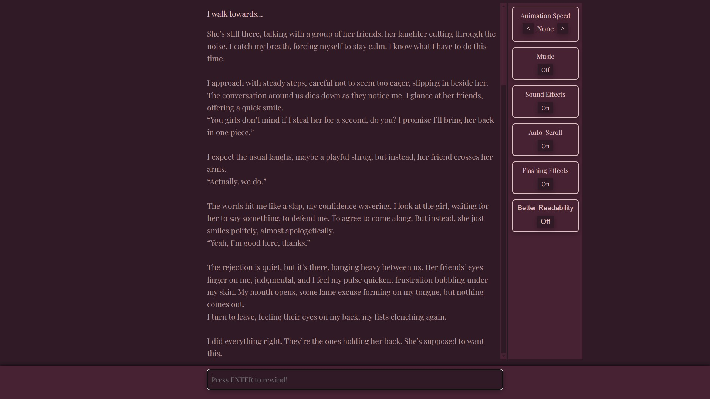

# The Pick-Up Simulator: Ars Amatoria

**The Pick-Up Simulator: Ars Amatoria** is a dark, satirical interactive fiction game that takes the form of a modified parser-based experience. Inspired by the absurdity of social media dating advice and the so-called “alpha male” influencers, the game places the player in the shoes of a young student trapped in a time loop, replaying the same moment over and over again—each time with the knowledge of previous failed attempts. What begins as an innocent attempt to approach his crush quickly spirals into something far more unsettling.  

---

## **Features**
- **Time Loop:** Every failed attempt resets the conversation, but the knowledge from each loop carries forward. Learn from your mistakes... or fall deeper into toxic behavior.
- **Interactive Parser:** Type commands to interact with your environment and the girl, the game providing hidden words that reveal their letters as you type, easing newcomers into the format, guiding you, but not always toward the right choice.
- **Satirical Narrative:** A commentary on the absurdity of pick-up artist culture, gradually subverting the player's expectations as their actions grow more disturbing.
- **Multiple Endings:** Your actions and choices determine different possible outcomes, ranging from reflective regret to total obsession. Check the *Rewind History* to see all the paths you already found.

## Setting:
You begin just outside your final exam, free from the weight of textbooks and stress, and there she is—the girl you've barely spoken to all semester but can't stop thinking about. This is your chance, one more time... but what will you do with it?

  
  
  

---

## **Installation & Launch Instructions**  

No installation required—**The Pick-Up Simulator: Ars Amatoria** is a browser-based game:  
1. Open the game page on **[itch.io](https://anjomorto.itch.io/ars-amatoria)**  
2. Click **Play**  
3. Use your keyboard to type commands and uncover available actions  

## **Dependencies & Libraries**  

The game is built in **JavaScript** and uses no external libraries beyond standard browser functionality. The mechanics are designed to work natively in any modern web browser.  

---

## **Credits & Licensing**  

- **Developed by:**       André *AnJoMorto* Fonseca
- **Concept & Writing:**  André *AnJoMorto* Fonseca
- **Graphics by:**        André *AnJoMorto* Fonseca
- **Music by:**            Darren Curtis Music

This project was developed within the **Summerschool "Transposition Ludique"** under **Yannick Rochat, David Javet, and Isaac Pante**, and as part of the course **"Développement de Jeu 2D"** under **Isaac Pante (SLI, Lettres, UNIL, Lausanne, CH).**  

---

## **AI GENERATED CONTENT DISCLOSURE**  

The **developer is open about their AI usage**:  
- AI assistance was used for **rewritings, text corrections, and code revision.**  
- The **core game design, writing, and concept remain original.**  
- All AI-generated content has been **reviewed, edited, and finalized by a human.**  

---

Feel free to try the demo on [itch.io](https://anjomorto.itch.io/ars-amatoria).

And join the conversation on [Discord](https://discord.gg/WKbWd5T8eK).